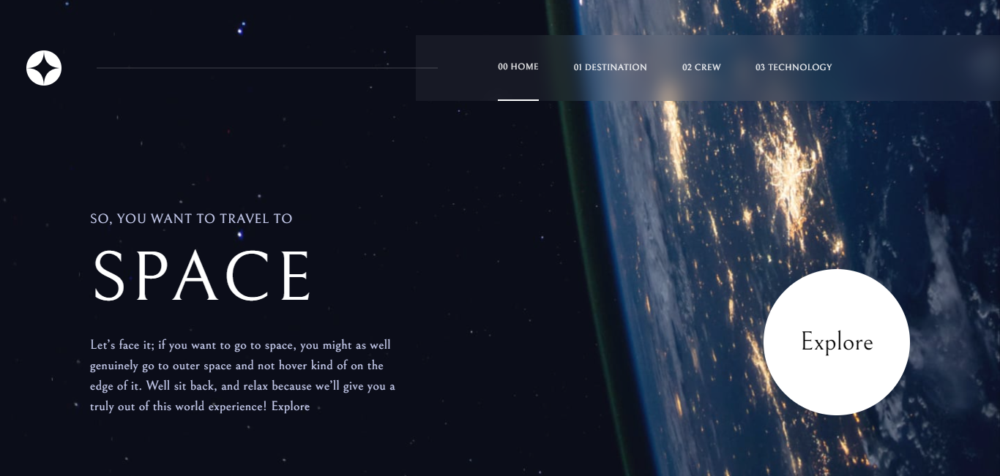
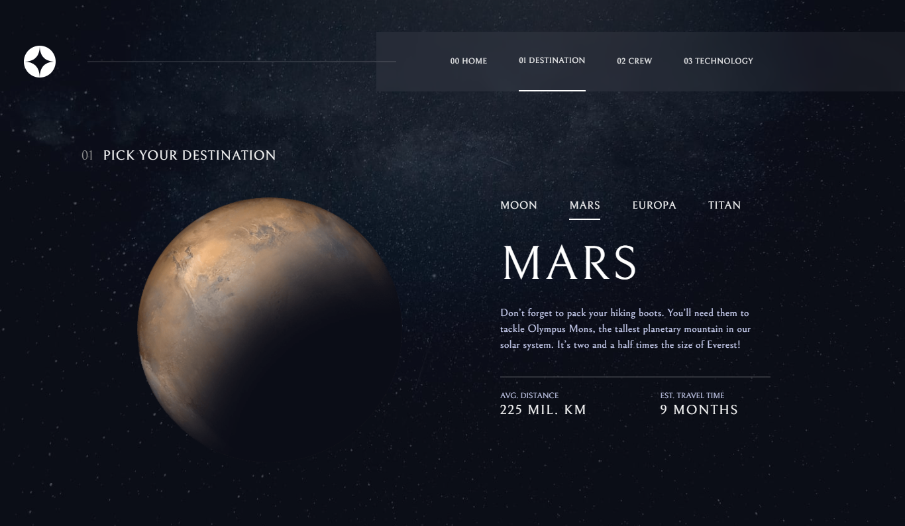
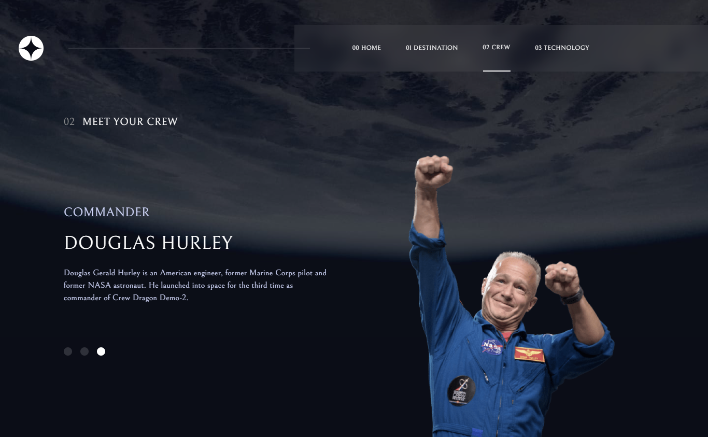
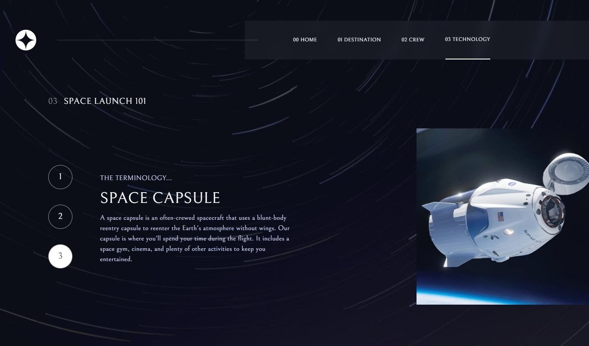
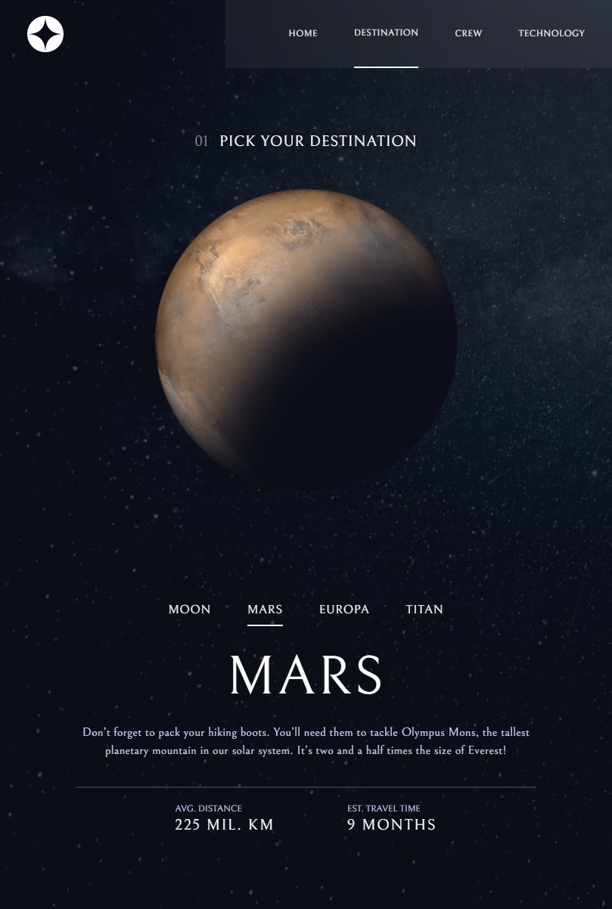
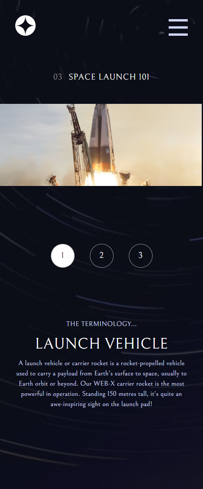

# Frontend Mentor - Space tourism website solution

This is a solution to the
[Space tourism website challenge on Frontend Mentor](https://www.frontendmentor.io/challenges/space-tourism-multipage-website-gRWj1URZ3).

## Table of contents

- [Links](#links)
- [The challenge](#the-challenge)
- [Screenshot](#screenshot)
- [Built with](#built-with)
- [Project setup](#Project-setup) -[Run for development](#Run-for-development)

### Links

- Solution URL:
  https://www.frontendmentor.io/solutions/space-tourism-spa-website-with-vue-and-tailwind-Ot8nBKcJ2Y
- Live Site URL: https://space-tourism-murex-three.vercel.app/

### The challenge

Users should be able to:

- View the optimal layout for each of the website's pages depending on their
  device's screen size
- See hover states for all interactive elements on the page
- View each page and be able to toggle between the tabs to see new information

### Screenshot

 
 



### Built with

- HTML
- Tailwind CSS
- Vue 3

### Project setup

```
npm install
```

#### Run for development

```
npm run serve
```
